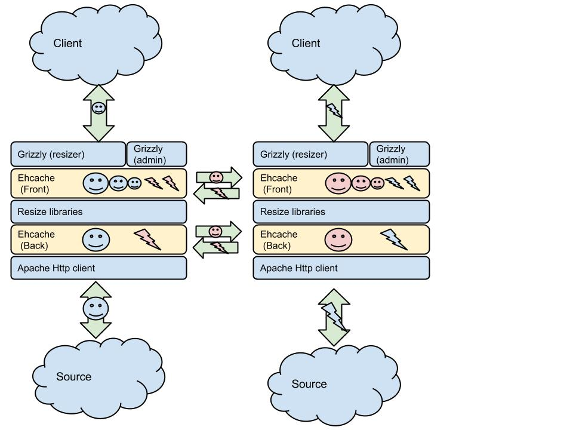

beume
=====

High performance, scalable and high available java based image resize service.

VERY EARLY STAGE 
----------------

Please test it. I will be very happy if you tell me the results. Will do my best to invite you to a Beer if you ever go to Barcelona, and we'll chat about it or about anything.

Motivation
----------
Beume takes a source image, resizes it on the fly, and serves it directly to the client machine caching everything in the process. A pretty simple task.

I've worked in a fair amount of projects and a service of this kind is always needed at some point. Looks so easy that usually is re-done everytime.

Another comon point in those projects is that resizing becomes a can of worms when in production.

Resizing is a kind of a costly operation and usually ends up in:

* batch processing images and serve them statically. This tends to cause integration problems and various logistic nuissances for content managers and designers.
* Use a dynamic server to resize images on the fly. This involves generally a big service train of caches and services on more servers that would be desirable. That causes rage on sysadmin and ops teams.

I've been looking for a solution to this problem on all the internets and found a little or nothing. So I've created one.

I've tried to solve all the problems of the task in the simpler and more efficient way possible.

Beume is a front-end cache, a dynamic resizer and a back-end cache on a single service. It can scale horizontally and vertically with full high availability.

Features
--------

* Have very little code of my own. The service is just a small binding code between grizzly, ehcache and some resizing libraries. Reinvented the less wheels as possible.
* Fully Multi-Threaded NIO server. From end to end. Some resize libraries are even capable of parallell resizing. It will burn all your CPUS.
* Capable of all the things ehcache is capable. That includes features very suited for this resizing task: No Cache Stampede, Lateral caching for sibling server update, disk backing store, auto discovery.... 
* Simple. One jar and a couple of config files. (Well, ehcache one is not that simple....)
* A (minimal right now) admin page.

A bad drawn diagram of Beume architecture, showing also the fanciness of lateral cache:

A miss of any image, will be populated to all the servers of the cluster. So in case of a failure of one of the servers, all the rest have all the content. It also makes sharding unnecessary performance-wise (All images are calculated only once). You can still use sharding for memory constrains (If you want. allthough this have to be configured outside, on the load balancer)

To-Do
-----
* Able to prune and pin entries.
* Better admin page (With pruning and pining and cached image inspection)
* Modularize resizers. Some sort of plugin mechanism.
* Simplify ehcache configuration.
* Use a whitelist for source urls. (Now it's an open resizer, which is no good)
* Unit testing. (This has been a quick hack that scaled quickly, so no time to explain...)

Install
-------
* Download the project.
* Compile it. It is a Netbeans project, you can either open it with Netbeans and build, or just use maven to do its magic. (All dependecies are in the pom.xml)
* Create a directory called beume on your home dir and put a beume.properties and an ehcache.xml. Here you have a properties file with the defaults, and an ehcache sample config file to test. (Forgot to add a "-f" option to change the config file location :) You can change it in the code. Promise to do it ASAP)

### ~/beume/beume.properties

****

    BACK_ERROR_RETAIN_SECS=30
    HOST=localhost
    BASE_URL=/
    PORT=8080
    ADM_BASE_URL=/
    ADM_PORT=8085
    BACK_REQ_MAX_LENGTH=4194304
    ADM_HOST=localhost
    DEFAULT_FILTER=lanczos
    FRONT_ERROR_RETAIN_SECS=10    

****

### ~/beume/ehcache.xml (Basic config)

    <ehcache xmlns:xsi="http://www.w3.org/2001/XMLSchema-instance" xsi:noNamespaceSchemaLocation="../../../main/config/ehcache.xsd" name="cm2">
    <diskStore path="java.io.tmpdir/one"/>
    
    <defaultCache maxElementsInMemory="1000" eternal="false" timeToIdleSeconds="100" timeToLiveSeconds="100" >
    </defaultCache>
    
    <cache name="frontCache" maxElementsInMemory="100" eternal="false" timeToIdleSeconds="100" timeToLiveSeconds="100" memoryStoreEvictionPolicy="LRU">
    </cache>
    <cache name="backCache" maxElementsInMemory="500" eternal="false" timeToIdleSeconds="300" timeToLiveSeconds="600" memoryStoreEvictionPolicy="LRU">
    </cache>
    </ehcache>

****

* Run the jar 

    java -jar beume-1.0-SNAPSHOT.jar com.servershepherd.beume.App

And that's it, point the browser to <host>:8080 and put an URL like this one:

    http://<host>:8080/cidi.jpg?source=<Source url>&resize=WxH&filter=<Lanczos|imgscalr|thumbnailer>&q=<jpeg quality 1-100>

Admin/Stats page is here:
    http://<host>:8085/stats

Filters:
* lanczos: Uses the algorithm from this guy https://code.google.com/p/java-image-scaling/. Is faster than imgscalr (although, very little) and with the best quality (For me) of the three. Uses a multithreaded Lanczos3 algorithm. I presume the multithreading is the responsible of the small speed increase, so in load this may be negligible. It does not maintain image proportions, calculate your sizes.
* imgscalr: Pretty solid scaling algorithm from here: http://www.thebuzzmedia.com/software/imgscalr-java-image-scaling-library/. Is almost as fast as the above with my (harcoded) settings. A little too sharp results for me. Maybe need more tweaking of the options. Always maintains image proportions. Will scale to fit the box you define in HxW
* thumbnailer (or whatever not lanczos or imgscalr) : Uses Thumbnailator (https://code.google.com/p/thumbnailator/), it doesn't explain the algorithm used. Is the fastest, but the results are not as good as the previous ones for me. (Again, this is a matter of personal tast). It do not maintain image proportions.

Final note
-----------

I've still not fully tested the code in full production loads and with all the full fledged ehcache tweakery for HA and scaling. Just basic tests. Reviewers are welcomed

Hope is usefull for you!!

As usual, use at your own risk. I make no guarantees.
